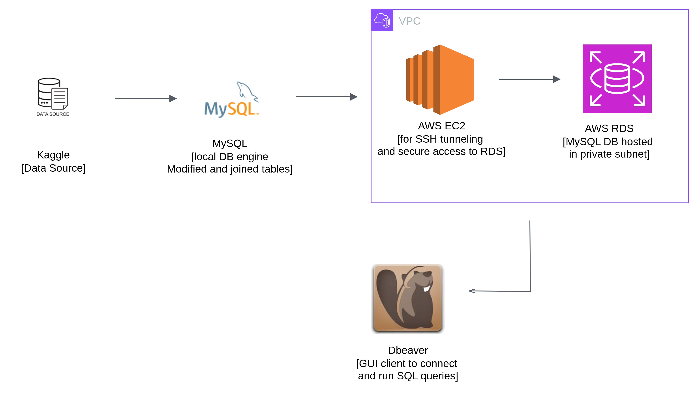
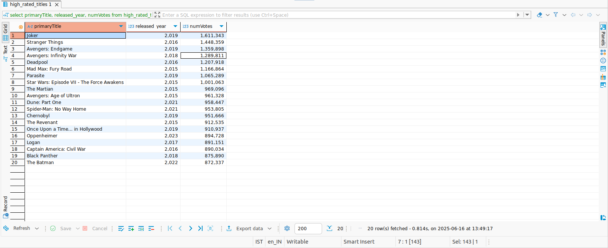

# IMDB Meets the Cloud: A Casual SQL Journey ....

Ever wondered what the most loved movies of the last decade are?

In this mini project, I took the massive IMDb dataset from [Kaggle](https://www.kaggle.com/datasets/ashirwadsangwan/imdb-dataset), filtered out the noise, ran it through a cloud-powered MySQL setup, and surfaced the highest-voted titles from the last 10 years. All using a mix of SQL, AWS, and some trial-and-error magic.

---

## Architecture Overview

Here’s a high-level view of how everything is wired together:

---

## What’s This Project About?

- Downloaded IMDb datasets from Kaggle (a huge one with lots of different tables).
- Loaded it into **local MySQL** and cleaned,modified it.
- Focused only on two specific tables:
  - `movie_title` (which I customized),
  - and `title_rating`.
- Joined these two to create a new table called `high_rated_titles`.

And then I thought... why keep it local?

---

## Moving to the Cloud

To make things more "cloudy":
- Set up an **EC2 instance** and **RDS MySQL** database inside a **custom VPC with subnets**.
- Transferred the local database to RDS.
- Created an **SSH tunnel** so I could connect DBeaver with RDS.

> Honestly though, I later realized I could’ve done everything through my terminal too. So, the DBeaver setup was more for convenience.

---

## Tech Stack

- **Language:** SQL
- **Tools:** MySQL, AWS RDS, EC2, VPC, Linux terminal, DBeaver
- **Data Source:** [IMDb Dataset on Kaggle](https://www.kaggle.com/datasets/ashirwadsangwan/imdb-dataset)

---

## Final Output

Using SQL queries on the cloud-hosted DB, I filtered out:

> **Movie Titles**,  
> **Release Year**,  
> **Number of Votes**

…for the most voted titles released during the **last decade** (2015–2024).

---

## DBeaver Exploration

Connected the cloud-hosted MySQL DB to DBeaver using an SSH tunnel. Ran the final query and viewed the results in a nice tabular format.

Here’s a peek:

---

##  All Commands & Queries

Curious about the exact steps and SQL magic behind this project?

 Check out [`commands_and_queries.md`](Code)

This file includes:

-  All **MySQL queries** (table creation, joins, filters, etc.)
-  Commands to **set up AWS services** – RDS, EC2, and VPC
-  Steps to **create an SSH tunnel** from local to RDS
-  How I installed and used **DBeaver** on my Ubuntu machine

Whether you're recreating this setup or just exploring how SQL + AWS work together, this companion file has you covered.

---

## Why I Did This?

Just wanted to get hands-on with:
- Real-world SQL on large datasets.
- Transferring MySQL databases from local to cloud (EC2 + RDS).
- Using DBeaver for database inspection and query writing.
- And of course, understanding **how to filter meaningful insights from massive data**.

---

## Learnings & Reflections

- SQL can be powerful and fun when you know what you're digging for.
- DBeaver is cool, but not a must. The terminal works just fine too.
- Moving DBs to the cloud is easier than I thought—but getting all the VPC, subnet, and security group configs right takes some trial and error!

---

## Next Steps?

Maybe try visualizing the results using tools like Power BI, Superset, or even Python dashboards. Or build a Streamlit app on top of it… who knows!

---

Thanks for reading!

